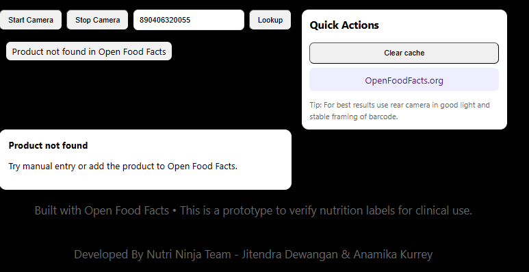
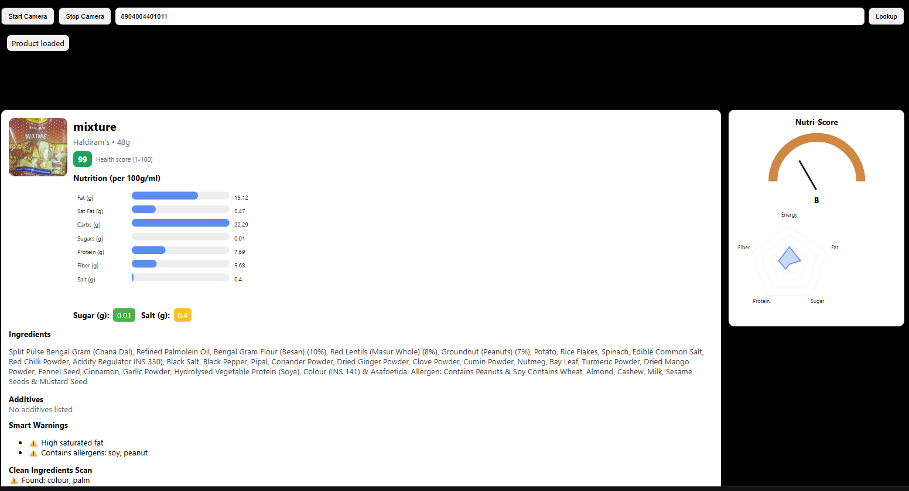

# 🥷 Nutri Ninja

<p align="center">
  <b>Eat Smart. Scan Fast. Decide Better.</b>
</p>

<p align="center">
  
  
  
  
</p>

---

##  About The Project

Nutri Ninja is a smart nutrition assistant that helps users make better food choices instantly.

Most people struggle to understand food labels, ingredients, sugar levels, and hidden unhealthy components.

Nutri Ninja solves this problem in seconds.

Just scan the barcode of any packaged food and get a clear nutrition dashboard to make smarter decisions.

---

##  Demo

🔗 Live Demo: *(https://www.linkedin.com/posts/jitendradewangan_ai-healthtech-startupjourney-activity-7434648226622013440--yk8?utm_source=share&utm_medium=member_desktop&rcm=ACoAAFmaX9wBTd0yGSkiUzk_lEUlFo2dzgAFxcE)*  
📱 APK Download: *Coming Soon*  
🎬 App Walkthrough Video: *Coming Soon*  

---

## 📸 Screenshots

> Create a folder named `screenshots` inside your repository and add your app images there.

### Home Screen
```
/screenshots/home.png
```

### Barcode Scanner
```
/screenshots/barcodd_scan.png
```

### Nutrition Dashboard
```
/screenshots/dashboard.png
```

### Health Analysis View
```
/screenshots/analysis.png
```

### Nutri Score Analysis View
```
/screenshots/analysis_2.png
```

### Nutri Info Analysis View
```
/screenshots/nutri_info.png
```

### Ingedients Analysis View
```
/screenshots/ingredients.png
```
### Smart Warning View
```
/screenshots/smart_warning.png
```
### Example
```
/screenshots/example.png
```

Then display them like this:

<p align="center">
  
  
  
</p>

---

## 🚀 Features

- 📷 Instant Barcode Scanning  
- 📊 Clean Nutrition Dashboard  
- 🧠 Smart Health Indicators  
- ⚡ Fast & Minimal UI  
- 🥗 Simple Food Decision Support  

---

## 🛠 Tech Stack

**Frontend**
- React Native
- Expo (if used)

**Backend**
- Node.js / Express *(Update if different)*

**Database**
- Firebase / MongoDB *(Update if different)*

**APIs**
- Nutrition API
- Barcode API

---

## ⚙️ Installation

Clone the repository:

```bash
git clone https://github.com/your-username/nutri-ninja.git
cd nutri-ninja
```

Install dependencies:

```bash
npm install
```

Run the project:

```bash
npm start
```

---

## 🧠 Future Roadmap

- AI-based food recommendations  
- Personalized nutrition tracking  
- Healthy alternative suggestions  
- Weekly health reports  
- Smart alerts for unhealthy patterns  

---

## 🤝 Contributing

Contributions are welcome.

1. Fork the repository  
2. Create a new branch  
3. Commit your changes  
4. Push and create a Pull Request  

---

## 👨‍💻 Author

**Jitendra Dewangan**  
AI Engineer in Progress  
Building practical AI-powered products that solve real-world problems.

🔗 LinkedIn: *https://www.linkedin.com/in/jitendradewangan/*  
  

---

## ⭐ Show Your Support

If you like this project:

- Star the repo  
- Share feedback  
- Connect with me  

Let’s make healthy decisions easier for everyone.
